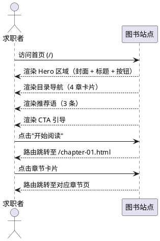
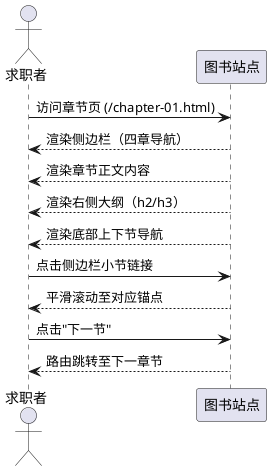
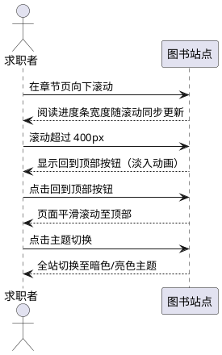
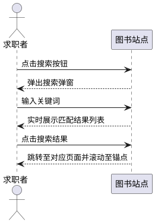
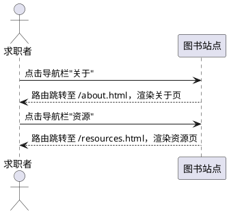

# **1. 组件定位**

## **1.1 核心职责**

本组件负责呈现《关于求职，你要知道的那些事》在线图书的全部内容，实现沉浸式阅读与章节导航体验。

## **1.2 核心输入**

1. **Markdown 内容文件**：`docs/` 目录下的 `.md` 文件，包含四章正文、关于页、资源页等全部图书内容
2. **首页 frontmatter 配置**：`index.md` 中通过 `layout: page` 指定首页使用自定义布局，并引入 `<HomePage />` 组件
3. **VitePress 站点配置**：`config.mts` 中定义的导航栏、侧边栏、搜索、主题等站点元数据
4. **自定义主题组件**：`HomePage.vue`、`Layout.vue`、`ReadingProgress.vue` 等 Vue 组件，提供首页布局、阅读进度条、回到顶部等交互能力；通过 `theme/index.ts` 注册 `HomePage` 为全局组件并扩展默认主题
5. **全局样式配置**：`custom.css`（Tailwind 基础层 + 组件层 + 实用层 + VitePress 样式覆盖）、`tailwind.config.js`（自定义色彩体系 paper/brand + 字体族 + 阅读行宽）、`postcss.config.js`（tailwindcss + autoprefixer 插件）定义的色彩体系、字体策略、排版规则
6. **静态资源**：`public/` 目录下的 `logo.svg`（站点 Logo，深靛蓝背景书籍图标）、`book-cover.svg`（图书封面，含书名/副标题/章节图标/书脊效果）

## **1.3 核心输出**

1. **静态 HTML 站点**：构建后输出至 `docs/.vitepress/dist/`，包含所有页面的 HTML、JS、CSS 及静态资源
2. **页面渲染结果**：首页（Hero + 目录导航 + 推荐语 + CTA）、四章内容页、关于页、资源页
3. **阅读交互反馈**：阅读进度条（顶部）、回到顶部按钮（右下角）、章节内锚点导航
4. **本地搜索索引**：基于 VitePress 本地搜索的中文全文检索能力

## **1.4 职责边界**

1. 本组件**不负责**用户认证与登录——站点为公开阅读，无用户系统
2. 本组件**不负责**后端 API 调用——纯静态站点，所有内容在构建时生成
3. 本组件**不负责**资源文件的实际下载——资源页仅展示资源描述，不提供真实下载链接
4. 本组件**不负责**评论与互动——无评论系统、无反馈表单
5. 本组件**不负责**多语言国际化——仅支持简体中文（zh-CN）

---

# **2. 领域术语**

**章节**
: 图书内容的顶级组织单元，全书共四章，每章包含三个小节，对应一个独立的 Markdown 文件。

**小节**
: 章节的子级内容单元，通过 Markdown 二级标题（h2）定义，在侧边栏和页面大纲中可导航。

**STAR 法则**
: 简历撰写的经典框架，依次为 Situation（情境）、Task（任务）、Action（行动）、Result（结果），用于结构化描述职业经历。
: 备注：第一章核心方法论。

**Offer 评估维度**
: 评估一份 Offer 价值的五个维度：薪资总包（30%）、成长空间（25%）、工作强度（20%）、公司平台（15%）、文化契合（10%）。
: 备注：第三章核心评估模型。

**经济补偿金（N）**
: 用人单位依法向劳动者支付的补偿，按工作年限计算，每满一年支付一个月工资。
: 备注：与违法解除的赔偿金（2N）区分。

**竞业限制**
: 劳动合同中约定劳动者离职后一定期限内不得从事同类业务的条款，用人单位须按月支付经济补偿。
: 备注：期限不得超过 2 年。

**阅读进度**
: 用户在当前页面的滚动位置占页面可滚动总高度的百分比，以顶部进度条形式可视化呈现。

**暗色模式**
: 站点提供的深色主题，通过 CSS 变量切换实现，所有组件和内容页均须支持亮色/暗色双主题。

**"总-分-总"结构化表达**
: 面试回答的推荐表达结构：先给结论，再展开 2-3 个要点论证，最后简短收束呼应核心信息。
: 备注：第二章面试沟通技巧的核心方法论。

**评估维度矩阵**
: 从薪资总包、成长空间、工作强度、公司平台、文化契合五个维度及对应权重（30%/25%/20%/15%/10%）综合评估 Offer 价值的框架。
: 备注：第三章 Offer 评估的核心工具。

**隐性成本**
: 评估 Offer 时容易被忽略的非薪资成本项，包括通勤时间、加班强度、试用期折扣、社保公积金基数差异、竞业限制等。
: 备注：第三章 Offer 评估的重要补充。

**VitePress 容器语法**
: Markdown 中使用 `::: tip`/`::: warning`/`::: danger` 包裹内容的特殊语法，VitePress 将其渲染为带图标和边框的提示框。
: 备注：章节内容中广泛使用，如"小贴士""注意""重要提醒"等。

---

# **3. 角色与边界**

## **3.1 核心角色**

- **求职者（读者）**：浏览图书内容、在各章节间导航、使用搜索查找内容、切换亮色/暗色主题的核心用户
- **站点维护者**：编辑 Markdown 内容文件、调整站点配置、构建并部署站点的运营人员

## **3.2 外部系统**

- **VitePress 构建引擎**：将 Markdown + Vue 组件编译为静态 HTML 站点
- **Vercel/静态托管平台**：托管构建产物的部署目标（当前未配置，但为典型部署方式）
- **Google Fonts / CDN**：提供 Noto Serif SC、Noto Sans SC 等中文字体的加载来源

## **3.3 交互上下文**

```plantuml
@startuml
left to right direction

actor "求职者（读者）" as reader
actor "站点维护者" as maintainer
system "求职指南图书站点" as site
system "VitePress 构建引擎" as vitepress
system "静态托管平台" as hosting
system "字体 CDN" as fontcdn

reader --> site : 浏览章节 / 搜索内容 / 切换主题
maintainer --> vitepress : 编辑 Markdown / 执行构建
vitepress --> site : 生成静态 HTML 站点
vitepress --> hosting : 输出构建产物
site --> fontcdn : 加载 Noto Serif SC / Noto Sans SC
reader --> fontcdn : 浏览器自动请求字体
@enduml
```

---

# **4. DFX约束**

## **4.1 性能**

1. 首页加载完成时间（LCP）**必须** ≤ 2.5 秒（良好网络条件下）
2. 站点构建时间**应当** ≤ 30 秒
3. 页面切换（SPA 路由）**必须** ≤ 200 毫秒
4. 阅读进度条更新频率**必须** ≥ 60fps，不得引起页面卡顿

## **4.2 可靠性**

1. 站点为纯静态站点，可用性取决于托管平台 SLA，目标 ≥ 99.9%
2. 所有页面链接（导航栏、侧边栏、章节内锚点）**必须**有效，不得出现 404
3. 构建过程**必须**零错误零警告完成

## **4.3 安全性**

1. 站点不收集用户个人信息，无需认证鉴权
2. 所有外部链接**必须**使用 `rel="noopener noreferrer"` 属性
3. 站点**禁止**包含任何可执行的用户输入内容（无 XSS 风险面）

## **4.4 可维护性**

1. 内容与样式分离：图书内容仅存在于 Markdown 文件中，组件和样式不硬编码正文
2. 站点配置集中管理：导航栏、侧边栏、搜索等配置统一在 `config.mts` 中定义
3. 主题组件独立：每个 Vue 组件职责单一，可独立修改和测试
4. 样式分层策略：`custom.css` 按 Tailwind 三层架构组织——`@layer base`（CSS 变量与全局重置）、`@layer components`（组件样式如进度条/回到顶部/卡片/按钮）、`@layer utilities`（工具类），VitePress 样式覆盖单独写在层外
5. 色彩体系集中定义：亮色/暗色双主题的所有色彩变量集中在 `custom.css` 的 `:root` 和 `.dark` 中定义，组件通过 CSS 变量引用，不硬编码颜色值
6. 侧边栏数据与首页数据同源：侧边栏章节结构在 `config.mts` 中定义，首页 `HomePage.vue` 中的 `chapters` 数据须与侧边栏配置保持一致

## **4.5 兼容性**

1. 浏览器兼容：**必须**支持 Chrome 90+、Firefox 90+、Safari 14+、Edge 90+
2. 响应式断点：**必须**适配桌面（>960px）、平板（640-960px）、手机（<640px）三种视口
3. 暗色模式：所有页面和组件**必须**同时支持亮色和暗色主题

---

# **5. 核心能力**

## **5.1 首页展示**

### **5.1.1 业务规则**

1. **Hero 区域展示规则**：首页**必须**展示图书封面（SVG）、书名、副标题、元信息（4 大章节 / 12 个小节 / 实战导向）和两个行动按钮（"开始阅读"链接至第一章、"了解更多"链接至关于页）
   - 验收条件：[访问首页] → [Hero 区域完整展示封面、标题、副标题、元信息、两个按钮]

2. **目录导航展示规则**：首页**必须**以 2×2 网格展示四章卡片，每张卡片包含章号、图标、标题、描述、三个小节链接和"阅读本章"入口
   - 验收条件：[访问首页] → [目录导航区展示 4 张章节卡片，每张包含 3 个小节链接]

3. **推荐语展示规则**：首页**必须**展示 3 条名家推荐，每条包含引言、姓名、头衔和头像首字
   - 验收条件：[访问首页] → [推荐语区域展示 3 条推荐卡片]

4. **CTA 引导规则**：首页底部**必须**展示行动号召区域，包含引导文案和"立即开始阅读"按钮
   - 验收条件：[滚动至首页底部] → [展示 CTA 区域，按钮链接至第一章]

5. **首页布局规则**：首页**必须**隐藏侧边栏和本地导航，内容全宽展示（最大宽度 1152px）
   - 验收条件：[访问首页] → [侧边栏和本地导航不可见，内容区全宽]

6. **首页响应式布局规则**：首页**必须**根据视口宽度自适应布局——Hero 区域在 ≤960px 时从横向排列变为纵向居中排列；目录导航网格在 ≤640px 时从 2 列变为 1 列；推荐语网格在 ≤960px 时从 3 列变为 1 列；行动按钮在 ≤640px 时从横向排列变为纵向全宽排列
   - 验收条件：[视口宽度 640px] → [Hero 纵向排列，目录 1 列，推荐语 1 列，按钮全宽纵向]

7. **封面交互规则**：图书封面**必须**支持 hover 交互效果——鼠标悬停时封面向上位移 8px 并微旋转 -1.5 度，阴影增强
   - 验收条件：[鼠标悬停封面] → [封面上移并微旋转，阴影加深]

8. **站点 Logo 规则**：导航栏左侧**必须**展示站点 Logo（logo.svg）和站点标题"求职指南"
   - 验收条件：[查看导航栏] → [左侧展示 Logo 图标和"求职指南"文字]

### **5.1.2 交互流程**



### **5.1.3 异常场景**

1. **封面图加载失败**
   - 触发条件：book-cover.svg 资源不可用
   - 系统行为：浏览器显示 alt 文本"关于求职，你要知道的那些事"
   - 用户感知：封面位置显示文字替代，不影响其他区域

2. **章节链接失效**
   - 触发条件：Markdown 文件被删除或重命名但 config.mts 未同步更新
   - 系统行为：VitePress 构建时产生 404 死链
   - 用户感知：点击后显示 404 页面

3. **首页与侧边栏数据不一致**
   - 触发条件：`config.mts` 中侧边栏章节结构已更新，但 `HomePage.vue` 中 `chapters` 数据未同步
   - 系统行为：首页展示的章节信息与侧边栏不一致
   - 用户感知：首页卡片标题/小节与实际章节内容不匹配

---

## **5.2 章节内容阅读**

### **5.2.1 业务规则**

1. **章节内容渲染规则**：每个章节页**必须**完整渲染对应 Markdown 文件的全部内容，包括标题、正文、列表、表格、代码块、引用块、提示容器（tip/warning/danger）
   - 验收条件：[访问任意章节页] → [页面完整渲染该章所有 Markdown 内容]

2. **侧边栏导航规则**：所有章节页**必须**展示统一的侧边栏，包含四章及其下属小节的导航链接，当前章节高亮
   - 验收条件：[访问 chapter-02] → [侧边栏展示全部四章，第二章高亮]

3. **页面大纲规则**：每个章节页右侧**必须**展示 2-3 级标题的大纲导航，标题为"本节目录"
   - 验收条件：[访问章节页] → [右侧大纲展示 h2 和 h3 级标题链接]

4. **上下节导航规则**：每个章节页底部**必须**展示"上一节"/"下一节"导航，文案为"上一节"/"下一节"
   - 验收条件：[访问 chapter-02] → [底部显示"上一节"指向 chapter-01，"下一节"指向 chapter-03]

5. **内容区宽度规则**：章节内容区最大宽度**必须**为 80ch，保障最佳阅读行宽
   - 验收条件：[访问章节页] → [内容区最大宽度为 80ch]

6. **Markdown 特殊语法渲染规则**：章节内容中的 VitePress 容器语法**必须**正确渲染——`::: tip` 渲染为提示框（蓝色边框，圆角 8px），`::: warning` 渲染为警告框（圆角 8px），`::: danger` 渲染为危险提醒框（圆角 8px）
   - 验收条件：[访问 chapter-01] → ["小贴士"容器渲染为蓝色边框提示框]

7. **引用块样式规则**：Markdown 引用块（`>`）**必须**渲染为左侧品牌色边框（3px）+ 品牌色浅底 + 圆角（0 8px 8px 0）+ 衬线字体，增强书籍质感
   - 验收条件：[访问包含引用块的章节] → [引用块展示为左侧蓝色竖线 + 浅蓝底色 + 圆角]

8. **表格样式规则**：Markdown 表格**必须**渲染为书籍质感样式——表头使用衬线体加粗 + 品牌色底边框（2px），行悬停高亮（品牌色浅底），支持横向滚动
   - 验收条件：[访问包含表格的章节] → [表头衬线加粗，底边蓝色，行悬停高亮]

9. **代码块样式规则**：Markdown 代码块**必须**渲染为圆角（8px）+ 适当上下间距（1.5em）
   - 验收条件：[访问包含代码块的章节] → [代码块圆角 8px，上下间距 1.5em]

10. **分隔线样式规则**：Markdown 分隔线（`---`）**必须**渲染为渐变淡入淡出效果（两端透明，中间分割色），上下间距 2em，模拟书籍章节分隔
    - 验收条件：[访问包含分隔线的章节] → [分隔线为渐变效果，两端淡出]

11. **章节内容响应式规则**：章节内容**必须**根据视口宽度调整排版——≤960px 时 h1 缩至 1.6rem、h2 缩至 1.3rem；≤640px 时正文字号缩至 0.94rem、行高 1.75、h1 缩至 1.4rem、引用块和表格内边距缩减
    - 验收条件：[视口宽度 640px 访问章节] → [字号和间距均缩小适配]

### **5.2.2 交互流程**



### **5.2.3 异常场景**

1. **Markdown 语法错误**
   - 触发条件：Markdown 文件包含无法解析的语法
   - 系统行为：VitePress 尽力渲染，错误部分显示为原始文本
   - 用户感知：部分内容显示异常，但不影响其他区域

2. **锚点跳转失效**
   - 触发条件：标题被修改导致锚点 ID 变化，但侧边栏链接未同步
   - 系统行为：页面不滚动或滚动到顶部
   - 用户感知：点击侧边栏链接后页面位置不正确

---

## **5.3 阅读辅助交互**

### **5.3.1 业务规则**

1. **阅读进度条规则**：非首页**必须**在页面顶部展示阅读进度条，宽度随滚动位置从 0% 到 100% 线性变化；首页**禁止**展示阅读进度条
   - 验收条件：[在章节页滚动至 50% 位置] → [进度条宽度为 50%]；[访问首页] → [进度条不可见]

2. **阅读进度条颜色规则**：亮色模式下进度条颜色**必须**为 #1a365d，暗色模式下**必须**为 #7b9ec7
   - 验收条件：[切换至暗色模式] → [进度条颜色变为 #7b9ec7]

3. **回到顶部按钮规则**：当页面滚动超过 400px 时，右下角**必须**显示回到顶部按钮；滚动不足 400px 时隐藏
   - 验收条件：[滚动至 500px 位置] → [回到顶部按钮可见]；[滚动至 300px 位置] → [按钮不可见]

4. **回到顶部行为规则**：点击回到顶部按钮后，页面**必须**平滑滚动至顶部
   - 验收条件：[点击回到顶部按钮] → [页面平滑滚动至 scrollY=0]

5. **主题切换规则**：站点**必须**支持亮色/暗色主题切换，切换后所有页面元素（背景、文字、边框、进度条、按钮等）均须响应主题变化
   - 验收条件：[点击主题切换按钮] → [全站色彩体系切换至对应主题]

6. **回到顶部按钮响应式规则**：回到顶部按钮**必须**根据视口宽度调整位置和尺寸——≤960px 时距底部 20px、距右侧 20px、尺寸 40×40px；>960px 时距底部 32px、距右侧 32px、尺寸 44×44px
   - 验收条件：[视口宽度 640px 滚动超过 400px] → [按钮位于右下角 20px 处，尺寸 40×40px]

7. **导航栏毛玻璃效果规则**：导航栏**必须**具有毛玻璃（backdrop-filter: blur(12px)）效果，使滚动内容在导航栏下方产生模糊视觉
   - 验收条件：[在章节页滚动] → [内容在导航栏下方呈现模糊效果]

8. **页面平滑滚动规则**：全局**必须**启用平滑滚动行为（scroll-behavior: smooth），所有锚点跳转和回到顶部操作均为平滑滚动
   - 验收条件：[点击侧边栏锚点链接] → [页面平滑滚动至目标位置]

### **5.3.2 交互流程**



### **5.3.3 异常场景**

1. **滚动事件性能问题**
   - 触发条件：滚动事件处理函数未使用 passive 监听或未做节流
   - 系统行为：滚动时页面卡顿
   - 用户感知：滚动不流畅，进度条更新延迟

2. **回到顶部按钮遮挡内容**
   - 触发条件：按钮定位与页面底部内容重叠
   - 系统行为：按钮覆盖在内容之上
   - 用户感知：部分内容被按钮遮挡，但按钮可点击

---

## **5.4 本地搜索**

### **5.4.1 业务规则**

1. **搜索入口规则**：导航栏**必须**展示搜索按钮，文案为"搜索"
   - 验收条件：[查看导航栏] → [搜索按钮可见，文案为"搜索"]

2. **搜索语言规则**：搜索功能**必须**支持中文内容检索，搜索界面文案全部中文化（按钮、无结果提示、清除查询、选择/切换/关闭等）
   - 验收条件：[打开搜索弹窗] → [所有界面文案为中文]

3. **搜索范围规则**：搜索**必须**覆盖全部 Markdown 内容（四章正文、关于页、资源页）
   - 验收条件：[搜索"STAR"] → [返回第一章相关内容]

### **5.4.2 交互流程**



### **5.4.3 异常场景**

1. **无匹配结果**
   - 触发条件：搜索关键词在所有内容中均无匹配
   - 系统行为：搜索弹窗显示"无法找到相关结果"
   - 用户感知：看到无结果提示，可清除查询重新搜索

---

## **5.5 关于页与资源页**

### **5.5.1 业务规则**

1. **关于页内容规则**：关于页**必须**展示写作初衷、作者介绍、本书特色（实战导向/系统全面/即查即用/法律护航）、内容概览表格和联系方式
   - 验收条件：[访问 /about.html] → [页面包含写作初衷、作者、特色、概览、联系方式五个区域]

2. **资源页内容规则**：资源页**必须**展示五大类资源描述——简历模板（通用模板 + 技术岗模板）、面试准备清单（7 天准备计划 + 50+ 问题应答手册）、Offer 评估工具（对比评分表 + 薪资总包计算器）、法律维权资料（合同审查清单 + 试用期权益速查卡）、推荐阅读表格
   - 验收条件：[访问 /resources.html] → [页面包含五大类资源描述及推荐阅读表格]

3. **导航栏规则**：导航栏**必须**包含"首页"、"关于"、"资源"三个入口
   - 验收条件：[查看导航栏] → [三个导航项可见且可点击]

4. **关于页与资源页侧边栏规则**：关于页和资源页**禁止**展示章节侧边栏（不属于任何章节路径）
   - 验收条件：[访问 /about.html] → [左侧无章节侧边栏]；[访问 /resources.html] → [左侧无章节侧边栏]

5. **GitHub 社交链接规则**：导航栏右侧**必须**展示 GitHub 图标社交链接
   - 验收条件：[查看导航栏右侧] → [GitHub 图标可见且可点击]

6. **站点 Favicon 规则**：站点**必须**使用 logo.svg 作为 favicon，类型为 image/svg+xml
   - 验收条件：[查看浏览器标签页] → [展示书籍图标 favicon]

7. **主题色 Meta 规则**：站点**必须**设置 meta theme-color 为 #f8f9fa
   - 验收条件：[查看页面 head] → [meta name="theme-color" content="#f8f9fa" 存在]

### **5.5.2 交互流程**



### **5.5.3 异常场景**

1. **资源下载链接不可用**
   - 触发条件：资源页中的下载链接指向不存在的文件
   - 系统行为：点击后浏览器显示 404 或无响应
   - 用户感知：无法下载资源文件

---

# **6. 数据约束**

## **6.1 章节内容（Chapter）**

1. **chapterId**：章节唯一标识，取值范围为 `chapter-01`、`chapter-02`、`chapter-03`、`chapter-04`
2. **title**：章节标题，非空，最大长度 50 字符
3. **sections**：小节列表，每章恰好包含 3 个小节
4. **icon**：章节图标，取值为 emoji 字符（📝/🎯/💡/⚖️）
5. **link**：章节链接路径，格式为 `/chapter-XX.html`

## **6.2 小节内容（Section）**

1. **sectionId**：小节唯一标识，格式为 `X.Y`（X 为章号 1-4，Y 为节号 1-3）
2. **title**：小节标题，非空，最大长度 80 字符
3. **anchor**：页面内锚点 ID，由 VitePress 根据标题自动生成，格式为 `_X-Y-标题slug`
4. **parentChapter**：所属章节的 chapterId，必填

## **6.3 推荐语（Endorsement）**

1. **name**：推荐人姓名，非空，2-4 个中文字符
2. **title**：推荐人头衔，非空，最大长度 60 字符
3. **quote**：推荐引言，非空，最大长度 300 字符
4. **avatar**：头像显示字符，取姓名首字，1 个中文字符

## **6.4 站点配置（SiteConfig）**

1. **lang**：站点语言，固定为 `zh-CN`
2. **title**：站点标题，固定为"关于求职，你要知道的那些事"
3. **outlineLevel**：大纲显示级别，固定为 [2, 3]，即仅展示 h2 和 h3
4. **contentMaxWidth**：内容区最大宽度，章节页为 `80ch`，首页为 `1152px`
5. **scrollThreshold**：回到顶部按钮显示的滚动阈值，固定为 400px

## **6.5 主题色彩（ThemeColors）**

1. **brandPrimary**：品牌主色，亮色模式 #1a365d，暗色模式 #7b9ec7
2. **bgBase**：基础背景色，亮色模式 #f8f9fa，暗色模式 #12141a
3. **textPrimary**：主文字色，亮色模式 #1a1a2e，暗色模式 #e0e2e8
4. **progressBarColor**：进度条颜色，亮色模式 #1a365d，暗色模式 #7b9ec7
5. **fontSerif**：衬线字体族，固定为 "Noto Serif SC", "Source Han Serif SC", Georgia, serif
6. **fontSans**：无衬线字体族，固定为 "Noto Sans SC", "Source Han Sans SC", "Helvetica Neue", Arial, sans-serif

## **6.6 导航栏配置（NavConfig）**

1. **items**：导航项列表，固定包含 3 项——{ text: "首页", link: "/" }、{ text: "关于", link: "/about" }、{ text: "资源", link: "/resources" }
2. **logo**：站点 Logo 路径，固定为 "/logo.svg"
3. **siteTitle**：导航栏站点标题，固定为"求职指南"
4. **socialLinks**：社交链接列表，固定包含 1 项——{ icon: "github", link: "https://github.com" }

## **6.7 侧边栏配置（SidebarConfig）**

1. **groups**：侧边栏分组列表，固定包含 4 组，分别对应第一章至第四章
2. **group.text**：分组标题，格式为"第X章：章节名"
3. **group.items**：每组的导航项列表，固定包含 3 项，每项含 text（小节标题）和 link（锚点链接，格式为 /chapter-XX#_X-Y-标题slug）
4. **sidebar 路径映射**：仅在 `/chapter-01`、`/chapter-02`、`/chapter-03`、`/chapter-04` 路径下展示侧边栏，其他路径（如 /about、/resources）不展示

## **6.8 搜索配置（SearchConfig）**

1. **provider**：搜索提供者，固定为 "local"（VitePress 内置本地搜索）
2. **translations.buttonText**：搜索按钮文案，固定为"搜索"
3. **translations.noResultsText**：无结果文案，固定为"无法找到相关结果"
4. **translations.resetButtonTitle**：清除查询按钮文案，固定为"清除查询条件"
5. **translations.footer**：键盘操作提示，selectText="选择"、navigateText="切换"、closeText="关闭"

## **6.9 色彩体系（ColorSystem）**

1. **paper 色阶**：冷灰白色调，从 paper-50（#f8f9fa）到 paper-900（#1a1e2e），共 10 级，用于背景和文字层次
2. **brand 色阶**：深靛蓝/藏青色调，从 brand-50（#eef2f7）到 brand-900（#061222），共 10 级，用于品牌色和交互元素
3. **CSS 变量映射**：VitePress 主题变量（--vp-c-brand-1/2/3/soft、--vp-c-bg/bg-soft/bg-mute/bg-alt、--vp-c-text-1/2/3、--vp-c-border/divider/gutter）均映射到 paper/brand 色阶的具体色值